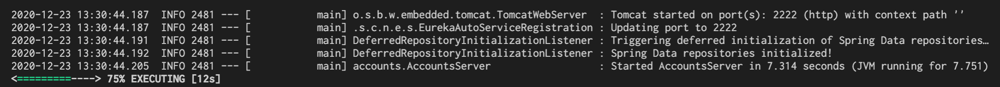
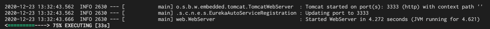
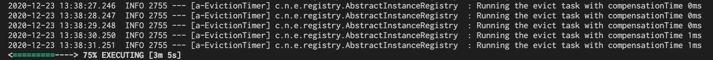
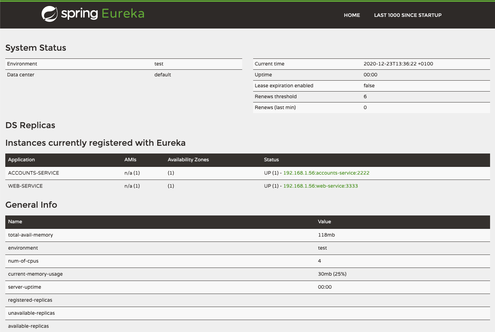
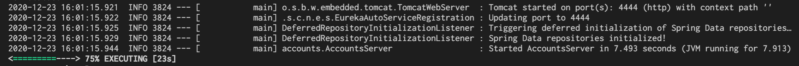
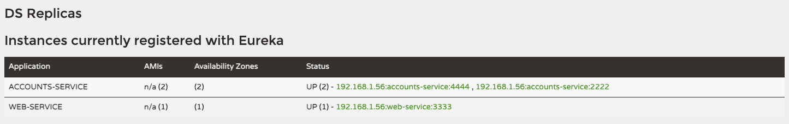
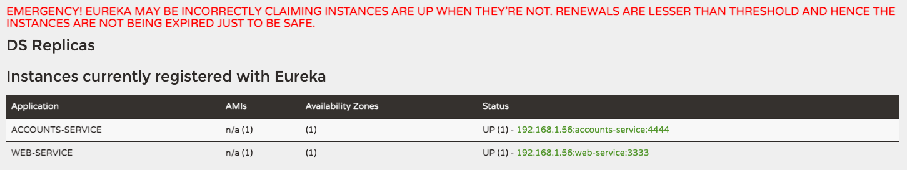

# Primary Goal Report

Report with screenshots describing what happens.

## First Activity

**The two microservices `accounts (2222)` and `web` are running and registered (two terminals, logs screenshots).**

* Execute `gradle :accounts:bootRun` and `gradle :web:bootRun` in two different terminals.

## Second Activity

**The service registration service has these two microservices registered (a third terminal, dashboard screenshots).**

* Execute `gradle :registration:bootRun`   in a third terminal. Then go to the dashboard at `localhost:1111` and check the correct registration.

## Third Activity

**A second `accounts` microservice instance is started and will use the port 4444. This second `accounts (4444)` is also registered (a fourth terminal, log screenshots).**

* Change the HTTP (Tomcat Server) Port in the `accounts/src/main/resources/application.yml` file to Port `4444`. Then, execute `gradle :accounts:bootRun`   in a fourth terminal. Finally, go to the dashboard at `localhost:1111` and check the correct registration.

## Fourth Activity

**What happens when you kill the microservice `accounts (2222)` and do requests to `web`?**
**Can the web service provide information about the accounts again? Why?**

* After kill the account microservice with Port `2222`, its registry entry dissappears from the Dashboard (show image). The Web service continues providing account information because of replication. Data is still accesibe at the account microservice with port `4444`.

